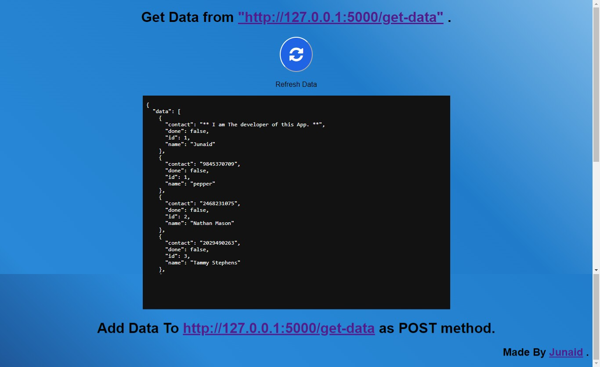

# Flask App

This is the example of simple Flask App but it supports html , with no-error , no-templateNotFound : Error , with full support of html , css , js and python , fully supported . Made by [Junaid](https://abujuni.dev) .



- Clone this Repository .
- Install Flask as `pip install flask` .
- Then go to -> http://127.0.0.1:5000 .

Boom ! , You have this awesome interface to see your data and with a refresh button .

- Go to [Postman](https://postman.com/download) .
- Use `GET` method to see your data .
- Use `POST` method to send something.

### Example :

- Use `POST` method to send something.

```json
{
  "name": "Junaid",
  "contact": "1234567890"
}
```

Done ! , You have sent some data to server .

- To See this go to -> http://127.0.0.1:5000 .
- Click on that blue big button to refresh the data at the page to see your data.

-> **Made By [Junaid](https://abujuni.dev) .**
